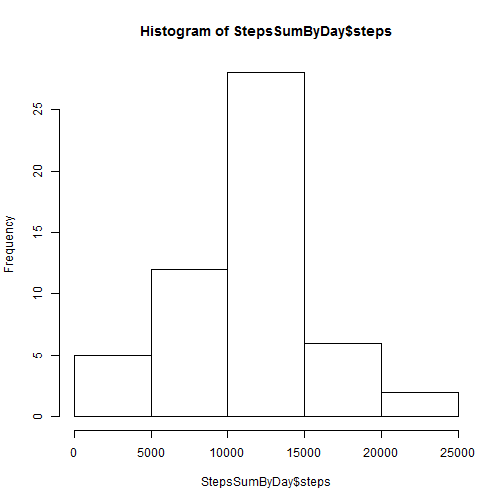
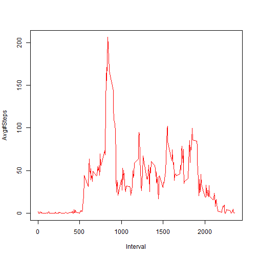
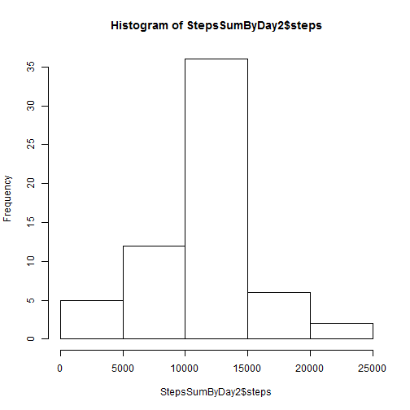
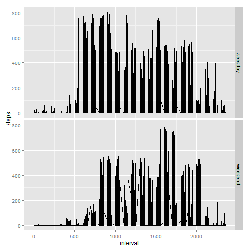

The GitHub account is :<https://github.com/WilliamThoreau/RepData_PeerAssessment1>.


## Loading and preprocessing the data

1. Clear all variables and load the activity.csv dataset that should be located in the default directory

```r
rm(list=ls(all=TRUE))  ## Clear all variables
FilePath <- paste0("./activity.csv")
ActivityData<-read.csv(FilePath)
```

2. Remove NA values because we cannot do anything with them.

```r
CleanActivityData <- ActivityData[!is.na(ActivityData$steps),]
```


## What is mean total number of steps taken per day?

1. Below table sumarizes the mean total number of steps taken per day

```r
StepsSumByDay <- aggregate(CleanActivityData$steps, by=list(CleanActivityData$date), FUN=sum)
colnames(StepsSumByDay) <- c("date","steps")
head(StepsSumByDay) #Only first few lines displayed for clarity
```

```
##         date steps
## 1 2012-10-02   126
## 2 2012-10-03 11352
## 3 2012-10-04 12116
## 4 2012-10-05 13294
## 5 2012-10-06 15420
## 6 2012-10-07 11015
```
2. Plot the histogram

```r
hist(StepsSumByDay$steps)
```

 

3. Median and Mean  

Mean of steps by Day

```r
StepsMeanByDay <- aggregate(CleanActivityData$steps, by=list(CleanActivityData$date), FUN=mean)
head(StepsMeanByDay) #Only first few lines displayed for clarity
```

```
##      Group.1        x
## 1 2012-10-02  0.43750
## 2 2012-10-03 39.41667
## 3 2012-10-04 42.06944
## 4 2012-10-05 46.15972
## 5 2012-10-06 53.54167
## 6 2012-10-07 38.24653
```
Median of steps by Day

```r
StepsMedianByDay <- aggregate(CleanActivityData$steps, by=list(CleanActivityData$date), FUN=median)
head(StepsMedianByDay) #Only first few lines displayed for clarity
```

```
##      Group.1 x
## 1 2012-10-02 0
## 2 2012-10-03 0
## 3 2012-10-04 0
## 4 2012-10-05 0
## 5 2012-10-06 0
## 6 2012-10-07 0
```


## What is the average daily activity pattern?

Make a time series plot (i.e. type = "l") of the 5-minute interval (x-axis) and the average number of steps taken, averaged across all days (y-axis)

1. Aggregate the steps by interval, using mean function

```r
StepsMeanByInterval <- aggregate(CleanActivityData$steps, by=list(CleanActivityData$interval), FUN=mean)
colnames(StepsMeanByInterval) <- c("interval","steps")
#Generate the plot:
plot(StepsMeanByInterval$interval, StepsMeanByInterval$steps, xlab= "Interval", ylab= "Avg#Steps", type="l", col="red")
```

 

2. Gives the interval for which the maximum number of steps were taken on average

```r
StepsMeanByInterval[StepsMeanByInterval$steps == max(StepsMeanByInterval$steps),]
```

```
##     interval    steps
## 104      835 206.1698
```


## Imputing missing values
1. The number of missing values (rows containing a NA) is: (regardless in which column the NA is)

```r
nrow(ActivityData[!complete.cases(ActivityData)==TRUE,])
```

```
## [1] 2304
```

2. My strategy to fill the missing data is to use the mean of the 5-minute interval mean of steps over the days  
First we compute the 5-minute interval mean of steps over the days

```r
StepsMeanByInterval <- aggregate(CleanActivityData$steps, by=list(CleanActivityData$interval), FUN=mean)
colnames(StepsMeanByInterval) <- c("interval","steps")
```

3. Then Replace the NA by the mean values as per the strategy defined above

```r
ActivityDataFilled <- ActivityData
RowsWithMissingValues <- c(1:length(!complete.cases(ActivityData)==TRUE))[!complete.cases(ActivityData)]

#Replace values in the DataFrame
for(i in RowsWithMissingValues) {
	ActivityDataFilled[i,1] <-StepsMeanByInterval[StepsMeanByInterval$interval== ActivityDataFilled[i,3],2]
}
```


4. Make a histogram of the total number of steps taken each day
##Sumarize the data by day

```r
#Sums the number of steps taken, by day
StepsSumByDay2 <- aggregate(ActivityDataFilled$steps, by=list(ActivityDataFilled$date), FUN=sum)
#Rename the columns
colnames(StepsSumByDay2) <- c("date","steps")
#Plot the histogram
hist(StepsSumByDay2$steps)
```

 

```r
# Mean of steps by Day
StepsMeanByDay2 <- aggregate(ActivityDataFilled$steps, by=list(ActivityDataFilled$date), FUN=mean)
head(StepsMeanByDay2) #Only first few lines displayed for clarity
```

```
##      Group.1        x
## 1 2012-10-01 37.38260
## 2 2012-10-02  0.43750
## 3 2012-10-03 39.41667
## 4 2012-10-04 42.06944
## 5 2012-10-05 46.15972
## 6 2012-10-06 53.54167
```

```r
# Median of steps by Day
StepsMedianByDay2 <- aggregate(ActivityDataFilled$steps, by=list(ActivityDataFilled$date), FUN=median)
head(StepsMedianByDay2) #Only first few lines displayed for clarity
```

```
##      Group.1        x
## 1 2012-10-01 34.11321
## 2 2012-10-02  0.00000
## 3 2012-10-03  0.00000
## 4 2012-10-04  0.00000
## 5 2012-10-05  0.00000
## 6 2012-10-06  0.00000
```

#### Analysis of the changes:
Do these values differ from the estimates from the first part of the assignment?  
Yes for some days there are a slight evolution (increase) of the mean and median values  
What is the impact of imputing missing data on the estimates of the total daily number of steps?  
Since we have added a few values the total daily number of steps increased.  


## Are there differences in activity patterns between weekdays and weekends?
1. Create a new factor variable

```r
#We create a new dataframe (Segregate) from the initial dataset from which the null values were removed.
Segregate <- CleanActivityData

# Change dates into their Weekday name
SegregateDays <- weekdays(as.Date( Segregate$date), abbreviate = FALSE)

# Change Weekday name into "weekday" or "weekend"
SegregateDays[SegregateDays=="Monday"] <- "weekday"
SegregateDays[SegregateDays=="Tuesday"] <- "weekday"
SegregateDays[SegregateDays=="Wednesday"] <- "weekday"
SegregateDays[SegregateDays=="Thursday"] <- "weekday"
SegregateDays[SegregateDays=="Friday"] <- "weekday"
SegregateDays[SegregateDays=="Saturday"] <- "weekend"
SegregateDays[SegregateDays=="Sunday"] <- "weekend"

# Sorry, but because my system is in french I need also to match the french day names
SegregateDays[SegregateDays=="lundi"] <- "weekday"
SegregateDays[SegregateDays=="mardi"] <- "weekday"
SegregateDays[SegregateDays=="mercredi"] <- "weekday"
SegregateDays[SegregateDays=="jeudi"] <- "weekday"
SegregateDays[SegregateDays=="vendredi"] <- "weekday"
SegregateDays[SegregateDays=="samedi"] <- "weekend"
SegregateDays[SegregateDays=="dimanche"] <- "weekend"

#Convert again as factor
SegregateDays <- as.factor(SegregateDays)

#To visualize data: summary(SegregateDays)
#Put back in the DataFrame
Segregate$date <- SegregateDays
```

2. Panel plot of the 5-minute interval (x-axis) and the average number of steps taken, averaged across all weekday days or weekend days (y-axis).

```r
#To visualize data:summary(Segregate$date)
library(ggplot2)
qplot(interval, steps, data = Segregate, facets=date~., geom = "line")
```

 


